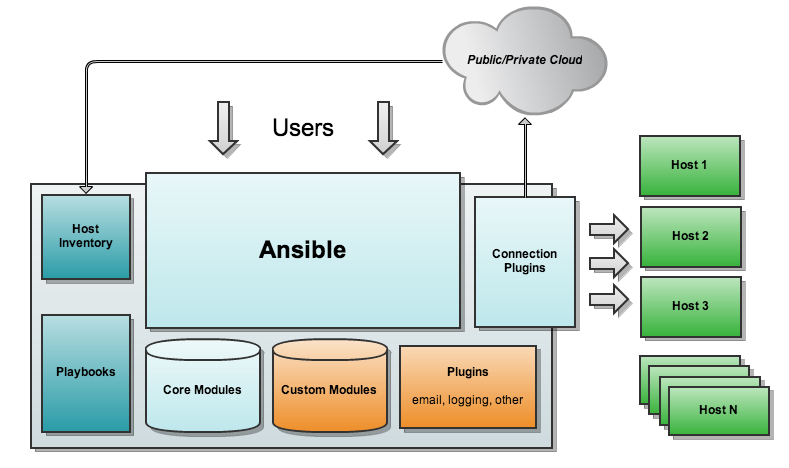
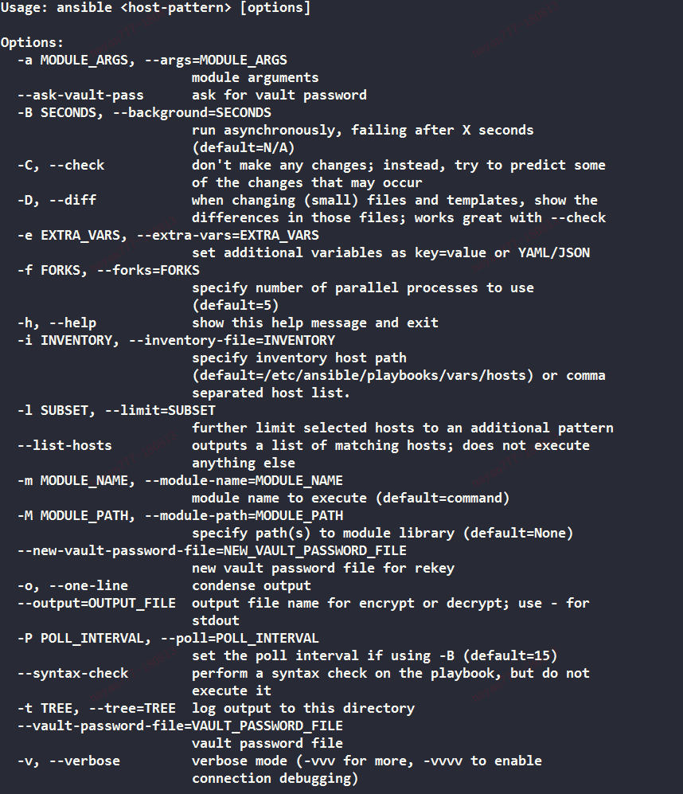
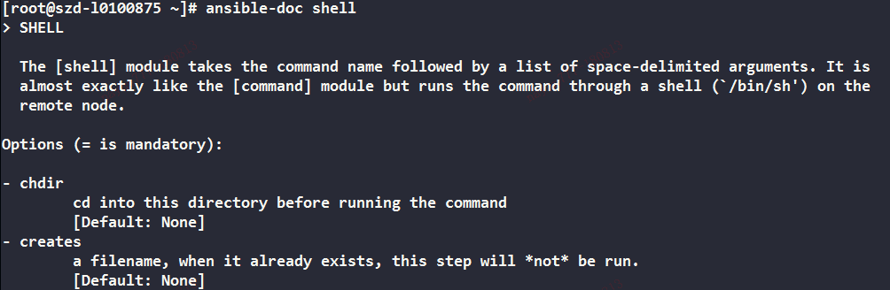
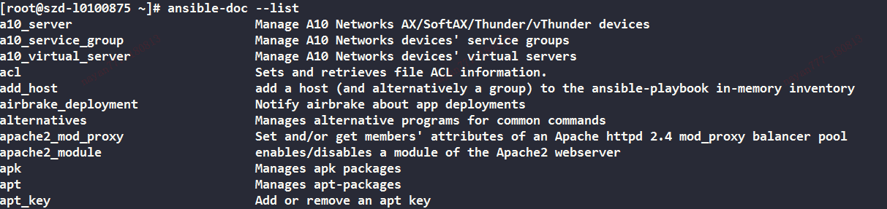
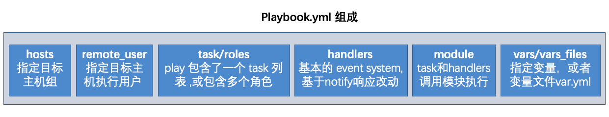
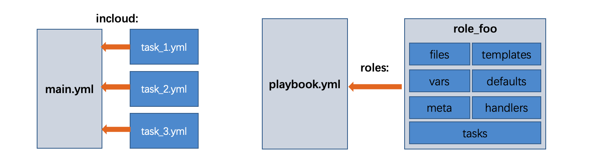

# Ansible Automation Guide

> 2020-05-14

A practical guide to Ansible covering architecture, ad-hoc commands, modules, playbooks, roles, Jinja2 templates, variables, conditionals, loops, and real-world automation patterns.

## Learning Path

1. Understand Ansible architecture
2. Install and configure Ansible, define Inventory
3. Learn playbook principles
4. Master ad-hoc commands
5. Explore Ansible modules
6. Write production playbooks
7. Create reusable Roles
8. Manage clusters at scale

## Architecture



Ansible is an agentless automation engine. The control node connects to managed nodes over SSH, reads task definitions from playbooks, and executes modules on remote hosts.

Core components:

- **Ansible Core** -- the engine itself, invoked via the `ansible` and `ansible-playbook` CLI tools
- **Core Modules** -- built-in modules shipped with Ansible (package management, file operations, service control, etc.)
- **Custom Modules** -- user-written extension modules for functionality not covered by core, written in Python or any language that returns JSON
- **Plugins** -- augment module capabilities: connection plugins, callback plugins, lookup plugins, filters, action plugins
- **Playbooks** -- YAML files defining ordered task sequences; the central configuration, deployment, and orchestration mechanism
- **Connection Plugins** -- the transport layer connecting to managed hosts; defaults to SSH (requires `sshpass` on CentOS for password-based auth), also supports local, Docker, and WinRM connections
- **Host Inventory** -- the registry of managed hosts, organized into groups

## Installation

```bash
# RHEL/CentOS via YUM
yum -y install ansible

# Any platform via pip
pip install ansible
```

## Configuration (`ansible.cfg`)

Ansible reads configuration from `ansible.cfg` in the following precedence: `ANSIBLE_CONFIG` env var > `./ansible.cfg` > `~/.ansible.cfg` > `/etc/ansible/ansible.cfg`.

```ini
[defaults]
inventory   = /etc/ansible/hosts
roles_path  = /etc/ansible/roles
log_path    = /var/log/ansible.log
remote_tmp  = ~/.ansible/tmp
local_tmp   = ~/.ansible/tmp

forks       = 5
remote_user = root
remote_port = 22
timeout     = 10

[privilege_escalation]
become      = true
become_user = root
```

## Ansible CLI Tools

Ansible ships with seven command-line utilities:

| Command | Purpose |
|---|---|
| `ansible` | Core command for ad-hoc (one-off) tasks on target hosts; defaults to the `command` module |
| `ansible-doc` | Browse module documentation; `-l` lists all modules, `-s` shows a usage snippet |
| `ansible-galaxy` | Download and install third-party roles/collections from [galaxy.ansible.com](https://galaxy.ansible.com/) |
| `ansible-lint` | Static analysis for playbooks: `ansible-lint playbook.yml` |
| `ansible-playbook` | Execute playbooks -- the most frequently used command |
| `ansible-pull` | Pull-based configuration management; pairs with Git + cron to pull and apply playbooks from a repository on large fleets without a control node |
| `ansible-vault` | Encrypt/decrypt sensitive data (passwords, keys, secrets) within playbooks; requires `--ask-vault-pass` or a password file at runtime |

## Command Invocation & Ad-Hoc Usage



The `/usr/bin/ansible` binary runs ad-hoc commands -- single tasks executed without a playbook file.

```bash
ansible <host-pattern> [options]
```

Common options:

| Flag | Description |
|---|---|
| `-f <forks>` | Number of concurrent threads (default: 5) |
| `-m <module>` | Module to invoke (defaults to `command`) |
| `-a <args>` | Module arguments as `key=value` pairs, space-delimited |
| `-v` / `-vvv` | Verbose output; higher verbosity shows more debugging detail |
| `-i <file>` | Use a specific inventory file |
| `-u <user>` | Connect as this remote user |
| `-b` / `--become` | Escalate privileges (sudo) |
| `--check` | Dry-run mode; report what would change without making changes |

### Ad-Hoc Examples

```bash
# Restart a service
ansible host -m service -a "name=pacemaker.service state=restarted"

# Run an arbitrary shell command
ansible host -m shell -a "systemctl status pacemaker"

# Copy a file to remote hosts
ansible host -m copy -a "src=/etc/hosts dest=/etc/hosts backup=yes"

# Create a directory
ansible host -m file -a "path=/opt/app state=directory mode=0755 owner=deploy group=deploy"

# Install a package
ansible host -m yum -a "name=httpd state=latest"

# Create a user
ansible host -m user -a "name=deploy group=wheel createhome=yes"

# Ping connectivity check
ansible all -m ping
```

## Working with Inventory

The inventory file defines which hosts Ansible manages and how to reach them. The default location is `/etc/ansible/hosts`. You can also specify multiple inventory files with `-i` or pull from dynamic sources (cloud providers, CMDBs).

```ini
# Group-based organization
[webservers]
web01.example.com ansible_ssh_host=192.168.1.10 ansible_ssh_user=root ansible_ssh_pass='securepass'
web02.example.com ansible_ssh_host=192.168.1.11 ansible_ssh_user=root ansible_ssh_pass='securepass'

[dbservers]
db01.example.com ansible_ssh_host=192.168.1.20 ansible_ssh_user=root

[production:children]
webservers
dbservers
```

For production, prefer SSH keys over passwords and store sensitive connection details in `group_vars/` or `host_vars/` rather than directly in the inventory file.

## Module Reference

Modules are the unit of work in Ansible. Every task in a playbook calls exactly one module. Modules receive `key=value` arguments and return JSON structured data.

```bash
# List all available modules
ansible-doc --list

# Read module documentation
ansible-doc shell
ansible-doc template
```





### Core Modules

| Module | Purpose |
|---|---|
| `command` | Execute a command on the remote node (default module; does not use shell interpolation) |
| `shell` | Execute a command through a shell (`/bin/sh`), supporting pipes, redirects, and variables |
| `ping` | Connectivity check -- verifies Ansible can reach the host and Python is available |
| `copy` | Copy a file from the control node to remote hosts |
| `fetch` | Pull files from remote hosts to the control node (inverse of `copy`) |
| `template` | Render a Jinja2 template locally and copy the result to remote hosts |
| `file` | Manage file/directory/symlink attributes: permissions, ownership, SELinux context |
| `yum` / `apt` | Package management for RHEL-based and Debian-based distributions |
| `pip` | Install Python packages with pip |
| `service` | Start, stop, restart, enable, or disable services |
| `cron` | Manage scheduled cron entries |
| `synchronize` | Efficient file transfer via `rsync` |
| `unarchive` | Extract archives (tar, zip, gz, etc.) on remote hosts |
| `user` / `group` | Create, modify, and delete OS users and groups |
| `debug` | Print messages during execution (essential for troubleshooting) |

### Module Invocation

```bash
# Ad-hoc style
ansible webservers -m service -a "name=httpd state=started"
ansible webservers -m ping

# Playbook style
- name: restart webserver
  command: /sbin/reboot -t now

- name: install httpd
  yum:
    name: httpd
    state: latest

- name: start and enable httpd
  service:
    name: httpd
    state: started
    enabled: yes
```

## Playbooks



Playbooks are YAML files that describe an ordered sequence of tasks to execute on managed hosts. They are the heart of Ansible -- combining host selection, variable definitions, task orchestration, and handler notification in one declarative file.

Invoke a playbook:

```bash
ansible-playbook playbook.yml -f 10
```

The `-f 10` flag controls parallelism (number of hosts to target simultaneously).

```yaml
---
- hosts: webservers
  vars:
    http_port: 80
    max_clients: 200
  remote_user: root
  tasks:
    - name: ensure apache is at the latest version
      yum:
        name: httpd
        state: latest

    - name: write the apache config file
      template:
        src: /srv/httpd.j2
        dest: /etc/httpd.conf
      notify:
        - restart apache

    - name: ensure apache is running
      service:
        name: httpd
        state: started

  handlers:
    - name: restart apache
      service:
        name: httpd
        state: restarted
```

This playbook demonstrates the notify-handler pattern: the config template task triggers a handler only when it actually makes a change. If the template result is unchanged, the handler does not fire.

## YAML Syntax

YAML is the data-serialization language used for Ansible playbooks and roles.

Rules:

- Every YAML file for Ansible begins with `---` (document start marker).
- Each playbook file is a list of plays. List items start with `- ` (dash then space) at the same indentation level.
- Key-value pairs use the `key: value` format (colon then space is mandatory).
- Indentation uses spaces (not tabs) and must be consistent across the file. Two spaces per level is the convention.
- Attributes within a dictionary share the same indentation level.

## Variables, Conditionals, and Loops

### Variables

Variables in Ansible come from multiple sources (precedence from lowest to highest): role defaults, inventory files, `group_vars/`, `host_vars/`, playbook `vars`, registered task output, and `--extra-vars` on the command line.

Facts are system information gathered at runtime (`ansible_os_family`, `ansible_all_ipv4_addresses`, etc.). Facts can be used in conditionals and templates.

```yaml
# Variables embedded in Jinja2 delimiters
vars:
  api_endpoint: "http://{{ ansible_default_ipv4.address }}:8080"
```

### Conditionals (`when`)

The `when` statement controls execution flow. It evaluates a Jinja2 expression; the task runs only if the expression is truthy.

```yaml
tasks:
  - name: "shutdown Debian systems"
    command: /sbin/shutdown -t now
    when: ansible_os_family == "Debian"

  - name: run setup script if IP matches
    shell: python script.py
    when: "'{{ node1_ip }}' in ansible_all_ipv4_addresses or '{{ node2_ip }}' in ansible_all_ipv4_addresses"
    register: script_output

  - name: print script output
    debug:
      msg: "{{ script_output.stdout }}"
```

The `register` keyword stores a task's return data in a variable for use in later tasks.

### Loops

Ansible supports iterating over lists, dictionaries, sequences, and nested structures.

```yaml
# Simple list iteration (legacy with_items)
- name: add several users
  user:
    name: "{{ item }}"
    state: present
    groups: wheel
  with_items:
    - testuser1
    - testuser2

# Modern loop with dictionary input
- name: enable services
  service:
    name: "{{ item.name }}"
    state: "{{ item.state }}"
    enabled: "{{ item.enabled }}"
  loop:
    - { name: ntpd,  state: restarted, enabled: yes }
    - { name: httpd, state: restarted, enabled: yes }
```

Available loop constructs: `with_list`, `with_items`, `with_indexed_items`, `with_flattened`, `with_together`, `with_dict`, `with_sequence`, `with_subelements`, `with_nested` / `with_cartesian`, `with_random_choice`. In modern Ansible, the `loop` keyword combined with filters (`flatten`, `zip`, `subelements`, `dict2items`) replaces most legacy constructs.

## Jinja2 Templates

Jinja2 is the template engine embedded in Ansible. It renders templates on the control node before files are deployed to remote hosts. Three syntax forms exist:

| Syntax | Purpose |
|---|---|
| `` | Control structures: conditionals, loops, block assignments |
| `{{ }}` | Variable substitution and expression evaluation |
| `{# #}` | Comments (not rendered in output) |

### Template Example

```ini
# keystone.conf template (rendered with Jinja2)
[keystone_authtoken]
auth_uri    = http://keystone.mgt.domain:{{ keystone_mgt_port1 }}
auth_url    = http://keystone.mgt.domain:{{ keystone_mgt_port2 }}
auth_plugin = password
project_domain_id = default
user_domain_id    = default
project_name = service
username     = neutron
password     = neutron
identity_uri = http://127.0.0.1:5000
```

Template tasks automatically locate source files in the `templates/` subdirectory of a role, so you can reference them by name without the full path:

```yaml
- name: deploy keystone configuration
  template:
    src: keystone.conf.j2
    dest: /etc/keystone/keystone.conf
  notify: restart keystone
```

## Roles & Includes



Roles are Ansible's mechanism for organizing playbooks into reusable, self-contained units. A role packages tasks, handlers, variables, templates, files, and metadata into a standardized directory structure.

The `include` mechanism lets you split large playbooks into smaller files for reuse. Roles are a formalized, higher-level abstraction built on top of includes -- they bundle related content and can declare dependencies on other roles.

In a playbook, you apply roles with the `roles:` keyword; they execute sequentially in the order listed.

```yaml
---
- hosts: webservers
  roles:
    - common
    - nginx
    - app-deploy
```

### Standard Role Directory Layout

```
roles/
  role_name/
    tasks/         # main.yml -- the primary task list executed when the role is called
    handlers/      # main.yml -- handlers referenced by notify from tasks
    vars/          # main.yml -- high-precedence variables (not overridable by user)
    defaults/      # main.yml -- default variables (lowest precedence; easy to override)
    files/         # static files referenced by copy or script tasks (no path prefix needed)
    templates/     # Jinja2 templates referenced by template tasks (no path prefix needed)
    meta/          # main.yml -- role metadata: author, license, platform, and role dependencies
```

Key behaviors:

- If `roles/x/tasks/main.yml` exists, its tasks are loaded into the play.
- If `roles/x/handlers/main.yml` exists, its handlers are loaded into the play.
- If `roles/x/vars/main.yml` exists, its variables are loaded into the play.
- If `roles/x/defaults/main.yml` exists, its defaults are loaded (lowest precedence).
- If `roles/x/meta/main.yml` exists, its role dependencies are added to the execution list.
- All `copy` tasks can reference files in `roles/x/files/` by bare filename (no path needed).
- All `script` tasks can reference scripts in `roles/x/files/` by bare filename.
- All `template` tasks can reference templates in `roles/x/templates/` by bare filename.
- All `include` tasks can reference files in `roles/x/tasks/` by bare filename.

## Tags

Tags let you selectively run or skip subsets of a playbook -- invaluable when you want to execute only a specific stage of a large playbook.

```bash
# Run only tagged tasks
ansible-playbook example.yml --tags "step_1,step_2"

# Skip specific tags
ansible-playbook example.yml --skip-tags "step_11,step_12"
```

```yaml
tasks:
  - name: install packages
    yum:
      name: "{{ item }}"
      state: present
    loop:
      - httpd
      - mariadb-server
    tags:
      - packages
      - bootstrap
```

Special built-in tags: `always` (task runs unless `--skip-tags always` is specified) and `never` (task is skipped unless its other tags are explicitly passed in `--tags`). The command-line triples `tagged`, `untagged`, and `all` control which set of tasks are selected; Ansible defaults to `--tags all` (run everything).

## Real-World Automation Examples

### Full Playbook: Web Server Setup

```yaml
---
- name: provision web server
  hosts: webservers
  become: yes
  vars:
    app_port: 8080
    app_user: deploy

  pre_tasks:
    - name: update package cache
      yum:
        update_cache: yes
      tags: always

  tasks:
    - name: install required packages
      yum:
        name:
          - nginx
          - git
          - python3
        state: latest
      tags: packages

    - name: create application user
      user:
        name: "{{ app_user }}"
        group: wheel
        createhome: yes
      tags: user

    - name: deploy nginx configuration
      template:
        src: nginx.conf.j2
        dest: /etc/nginx/nginx.conf
      notify: reload nginx
      tags: config

    - name: ensure app directory exists
      file:
        path: "/opt/{{ app_user }}/app"
        state: directory
        owner: "{{ app_user }}"
        mode: "0755"
      tags: deploy

    - name: clone application repository
      git:
        repo: "https://github.com/example/webapp.git"
        dest: "/opt/{{ app_user }}/app"
        version: main
      tags: deploy

    - name: start and enable nginx
      service:
        name: nginx
        state: started
        enabled: yes
      tags: service

  handlers:
    - name: reload nginx
      service:
        name: nginx
        state: reloaded
```

### Cluster Health Check (Ad-Hoc with Facts)

```bash
# Gather facts and filter by OS family
ansible all -m setup -a "filter=ansible_distribution"

# Check disk usage across the fleet
ansible all -m shell -a "df -h /" | grep -E "Use%|[8-9][0-9]%"

# Targeted restart of a service on a subset
ansible dbservers -m service -a "name=mariadb state=restarted"
```

## Best Practices

1. **Use roles for reusability**. If you find yourself copy-pasting tasks across playbooks, extract them into a role.

2. **Keep playbooks simple and declarative**. Playbooks should describe desired state, not procedural steps. Let Ansible's idempotency handle the "how."

3. **Version control everything** -- playbooks, roles, inventories, and `ansible.cfg`. Treat infrastructure as code.

4. **Use `ansible-lint`** before committing playbooks. Catch syntax errors and anti-patterns early.

5. **Encrypt secrets with `ansible-vault`**. Never store passwords, keys, or tokens in plain text.

6. **Separate configuration from code**. Use `group_vars/` and `host_vars/` to keep environment-specific values (IPs, credentials, resource sizes) out of playbook logic.

7. **Use tags** to organize tasks by concern (e.g., `packages`, `config`, `deploy`, `test`) and enable targeted execution.

8. **Run in check mode first** (`--check`) before applying changes to production hosts.

9. **Namespace role variables** with a role name prefix (e.g., `nginx_port` rather than `port`) to avoid collisions.

10. **Limit facts gathering** with `gather_facts: no` on plays that don't need them, especially in large inventories, to reduce execution time.

11. **Prefer `command` over `shell`** when you don't need shell features (pipes, redirects, globbing). The `command` module is not affected by the remote user's shell environment.

12. **Notify handlers to manage services**. Rather than restarting a daemon in every task, use `notify` so the handler fires once, at the end of the play, and only when a change actually occurred.

---

# END
