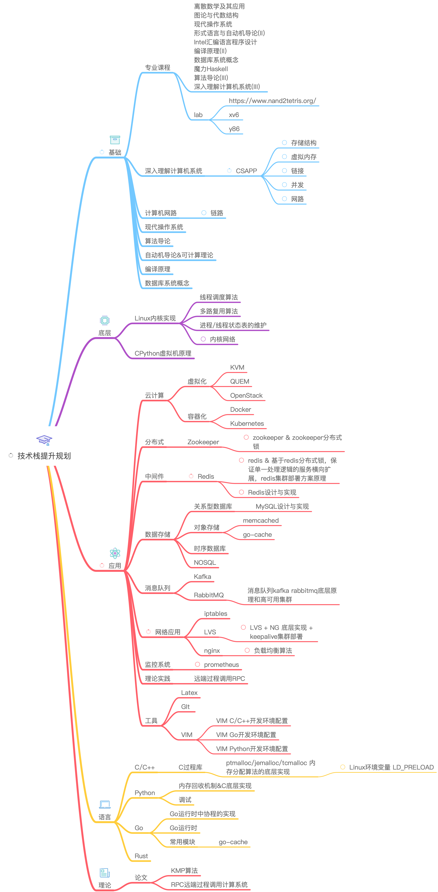

# Production TCP Network Issue Analysis

> 2020-04-16

A cascading failure investigation — how a traffic spike triggered TIME_WAIT exhaustion, socket starvation, and a self-reinforcing outage loop in a monitoring cluster behind nginx.

## Cluster Architecture



```

Agent → (L2 forwarding) → monitor_server (Tornado) → nginx (localhost) → OpenFalcon

```

## April 9 Incident: Timeline

### 1. Traffic Spike

A sudden traffic surge caused `monitor_server` requests to OpenFalcon to timeout en masse.

### 2. Socket Exhaustion Cascade

The timeout flood triggered a chain reaction:

1. **OpenFalcon timeouts** → server-side sockets enter CLOSE state
2. **Short-lived connections** to OpenFalcon → TCP connections continuously created and destroyed
3. **TIME_WAIT explosion** — every closed short-lived connection enters TIME_WAIT for 2 MSL (~60s)
4. `Socket_used`, `TCP_alloc`, `TIME_WAIT` metrics spiked in unison

### 3. The Bottleneck

Tornado processes agent data, metric processing, and OpenFalcon submission on the **same control flow**. This prevents fast write-back to created sockets, which in turn prevents epoll from multiplexing connections efficiently.

### 4. Port Exhaustion

A TCP connection is uniquely identified by the 4-tuple `{src_ip, src_port, dst_ip, dst_port}`. With only 65,535 ephemeral ports available on the client side, and 30 listening ports on the server side:

- New connections from nginx couldn't establish — destination sockets weren't being freed fast enough
- Health check (`hc.do`) requests hung waiting for file I/O scheduling
- **nginx detected failures and auto-removed servers** from the upstream pool

### 5. Death Spiral

nginx removing servers → remaining servers receive more load → more timeouts → more servers removed by nginx → agents keep sending data regardless → the cycle perpetuates. The system entered a self-reinforcing failure loop: nginx continuously adding and removing server instances while TIME_WAIT connections and HTTP 500 errors persisted.

## Diagnostic Commands

```bash
# Agent → server (short-lived TCP, via L2 forwarding)
# Many new connections + LAST_ACK connections (passive close)
netstat -npt | grep 127.0.0.1:51005

# Server → nginx:12057 (short-lived TCP)
# Many new connections + TIME_WAIT
netstat -ntp | grep 127.0.0.1 | grep 12057

# OpenFalcon data submission (short-lived TCP)
# Many new connections + TIME_WAIT
netstat -npt | grep 127.0.0.1

# All loopback connections
netstat -ntp | grep -E "127.0.0.1|127.0.0.1|127.0.0.1"

```

## Root Cause Summary

- TCP short-lived connections everywhere (no connection pooling)
- Tornado single-control-flow architecture bottlenecked write-back
- nginx auto-removal turned a partial failure into a complete outage
- Port exhaustion from TIME_WAIT prevented recovery
