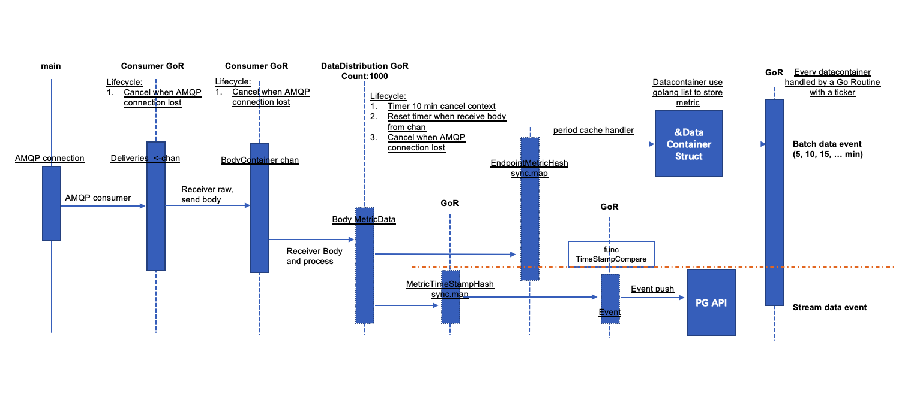
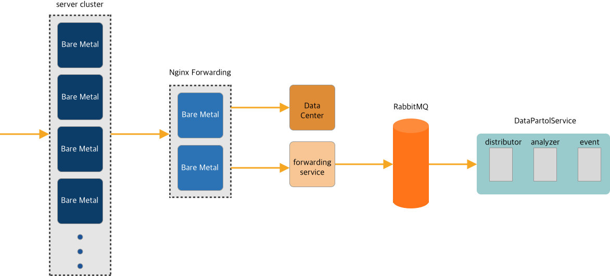

# Time-Series Data Integrity: Patrol Tool Design

> 2020-05-13

A Go-based audit tool for time-series monitoring data integrity — architecture, concurrency model, and the data flow from message queue to event storage.

## Architecture



Monitoring data enters a **RabbitMQ** message queue, enabling multiplexed consumption. The audit tool subscribes to the queue and performs three integrity checks:

1. **Per-interval completeness** — Is data present for every collection interval?
2. **Full data loss detection** — Did a monitoring object stop reporting entirely?
3. **Config coverage** — Do the reported metrics match the full initial configuration?

## Concurrency Model (Go)

The tool is built on Go goroutines with the following pipeline:



| Stage | Goroutines | Responsibility |
|---|---|---|
| **Consumer** | 1 (per queue) | Connects to RabbitMQ, receives messages, distributes via channel |
| **DataDistribution** | 1000 | Unpacks messages, routes each metric to its object-specific handler |
| **Object Handler** | Per monitored object | Caches timestamps on a stack; runs integrity checks each cycle |
| **Event Reporter** | 1 | Receives check results, persists to DB, serves frontend display |

### Safety Mechanisms

- Each object handler has a **10-minute timeout** — if no data arrives in that window, the goroutine self-terminates to prevent goroutine leaks and starvation.
- Dispatcher-to-handler communication uses buffered Go channels to decouple backpressure.

## Data Flow

```

RabbitMQ → Consumer → Channel → DataDistribution (×1000)
                                       ↓
                              Object Handler (per target)
                              ├── Cache timestamps on stack
                              ├── Periodic integrity check
                              └── → Event Reporter → DB → Frontend

```
