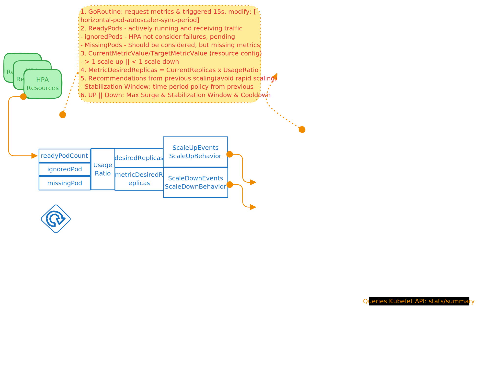

# Kubernetes HPA Controller

> 2025-03-12

A deep-dive review of the Kubernetes Horizontal Pod Autoscaler (HPA) — its control loop architecture, metric-driven replica calculation, and stabilization mechanisms that prevent thrashing in production clusters.

## Architecture Overview



The HPA controller runs as a **single-worker goroutine** within the kube-controller-manager. It processes each HPA resource every 15 seconds by default, configurable via `--horizontal-pod-autoscaler-sync-period`.

```
┌─────────────────────────────────────────────────┐
│                 kube-controller-manager           │
│  ┌──────────┐    ┌────────────┐    ┌──────────┐ │
│  │ HPA      │───>│ Metrics    │───>│ Scale    │ │
│  │ Controller│    │ API        │    │ Subresource│ │
│  └──────────┘    └────────────┘    └──────────┘ │
│       │                                       │
│       ▼                                       │
│  ┌──────────┐                               │
│  │ Delay    │ ← 15s interval per HPA        │
│  │ Queue    │                               │
│  └──────────┘                               │
└─────────────────────────────────────────────────┘
```

## HPA Workflow

### 1. Metric Collection

The controller requests **the last 5 minutes** of metrics from the metrics API, then extracts the **last 1 minute** for replica computation. It identifies three pod categories:

- **readyPodCount** — pods in Ready state serving traffic
- **ignoredPods** — pods excluded from scaling decisions (e.g., Pending, terminating)
- **missingPods** — pods not yet reporting metrics

### 2. Usage Ratio Calculation

```
UsageRatio = CurrentMetricValue / TargetMetricValue
```

- **> 1.0** → scale up (current load exceeds target)
- **< 1.0** → scale down (current load is below target)

### 3. Desired Replicas

```go
MetricDesiredReplicas = ceil(CurrentReplicas * UsageRatio)
```

The final desired replica count is bounded by `minReplicas` and `maxReplicas` from the HPA spec.

### 4. Multi-Metric Reconciliation

When multiple metrics are configured, `computeReplicasForMetrics` calculates a proposed replica count for each metric independently, then selects the **largest** value — the most conservative choice that satisfies all constraints.

## Metric Types

| Type | Source | Use Case |
|---|---|---|
| **Resource** | metrics-server | CPU/Memory utilization |
| **Pod** | custom metrics API | Requests per second per pod |
| **Object** | custom metrics API | Queue length, external metrics |
| **External** | external metrics API | Cloud Pub/Sub backlog, Prometheus |

## Stabilization & Behavior

### Stabilization Window

The `stabilizationWindowSeconds` field in `behavior` defines the lookback period for the **highest (scale-up) or lowest (scale-down) recommendation**. The controller tracks past recommendations and picks the most conservative value within this window to prevent rapid oscillation.

```yaml
behavior:
  scaleDown:
    stabilizationWindowSeconds: 300  # 5 min — avoid rapid scale-down
    policies:
    - type: Percent
      value: 10
      periodSeconds: 60
  scaleUp:
    stabilizationWindowSeconds: 60   # 1 min — allow faster scale-up
    policies:
    - type: Pods
      value: 4
      periodSeconds: 15
```

### Scaling Policies

Policies control the **rate** of change within the stabilization window:

- **Percent policy** — limit change to X% of current replicas per period
- **Pods policy** — limit change to X absolute pods per period

`calculateScaleUpLimitWithScalingRules` and `calculateScaleDownLimitWithBehaviors` enforce these limits, ensuring `|newReplicas - curReplicas|` stays within the allowed bound for the current window.

## Delay Queue Design

Each HPA resource, after its metrics are fetched and a scaling decision is made, is **re-enqueued** in a delay queue for the next sync cycle. This ensures:

1. Fair scheduling — no HPA starves others
2. Consistent 15s interval per resource
3. Back-pressure when the metrics API is slow

```
┌──────────┐    15s timer     ┌──────────────┐
│  Worker  │ ──────────────> │  Delay Queue  │
│  goroutine│ <────────────── │  (per HPA)    │
└──────────┘    re-enqueue    └──────────────┘
```

## Key Implementation Functions

| Function | Purpose |
|---|---|
| `computeReplicasForMetrics` | Proposes replicas for each metric, selects the max |
| `calculateScaleUpLimitWithScalingRules` | Caps scale-up rate per behavior policy |
| `calculateScaleDownLimitWithBehaviors` | Caps scale-down rate per behavior policy |
| `stabilizeRecommendation` | Applies stabilization window to avoid thrashing |

## Production Considerations

- **Metrics latency**: If the metrics API responds slowly, HPA decisions can use stale data. Monitor metrics API P99 latency.
- **Custom metrics reliability**: A missing custom metric can cause the HPA to skip a scaling cycle rather than make an unsafe decision.
- **Stabilization minimums**: Setting `stabilizationWindowSeconds` too low (<60s) can cause thrashing; too high (>600s) makes scaling unresponsive.
- **Cooldown vs stabilization**: Older HPA versions used `--horizontal-pod-autoscaler-downscale-delay`. Behavior-based stabilization (v2) is strictly better and replaces this.

## References

- [Kubernetes HPA Documentation](https://kubernetes.io/docs/tasks/run-application/horizontal-pod-autoscale/)
- [HPA Source (kube-controller-manager)](https://github.com/kubernetes/kubernetes/blob/master/pkg/controller/podautoscaler/horizontal.go)
- [Custom Metrics API](https://github.com/kubernetes-sigs/custom-metrics-apiserver)
